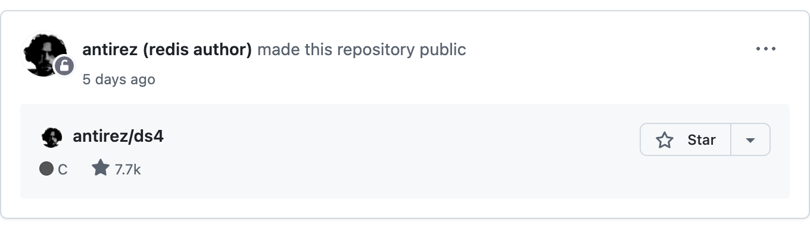
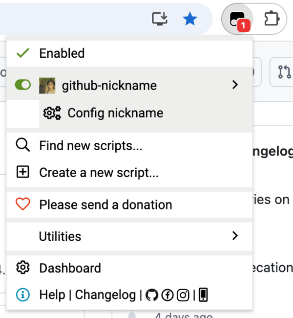
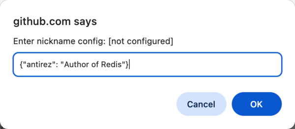

# User-Scripts

README [English](README.md) | [中文](README_ZH.md)

## What is this

A collection of Tampermonkey userscripts by FantasticMao, designed to enhance and customize the web browsing experience. Each script focuses on solving specific needs, making daily web usage more convenient.

|                                                                                  | Script Name     | Description                                              | Link                                                                                                           |
| -------------------------------------------------------------------------------- | --------------- | -------------------------------------------------------- | -------------------------------------------------------------------------------------------------------------- |
|  | github-nickname | Add nicknames for users on GitHub feed and profile pages | [Install](https://raw.githubusercontent.com/fantasticmao/user-scripts/refs/heads/main/github-nickname.user.js) |

## Download and Install

### Install Tampermonkey

You need to install the Tampermonkey extension in your browser first

- [Chrome version](https://chromewebstore.google.com/detail/dhdgffkkebhmkfjojejmpbldmpobfkfo)
- [Firefox version](https://addons.mozilla.org/en-US/firefox/addon/tampermonkey/)
- [Edge version](https://microsoftedge.microsoft.com/addons/detail/iikmkjmpaadaobahmlepeloendndfphd)

### Install Userscripts

Click the installation link for the corresponding script in the table above. Tampermonkey will automatically pop up an installation confirmation window — just click "Install".

## Quick Start

### github-nickname Script

**Preview**



**Configuration**

| Config Mode | Description                                                             | Config Entry                         | Example                              |
| ----------- | ----------------------------------------------------------------------- | ------------------------------------ | ------------------------------------ |
| JSON Mode   | Enter a JSON string, suitable for a small number of user nicknames      | Tampermonkey menu -> Config nickname | `{"torvalds": "Father of Linux"}`    |
| URL Mode    | Enter a URL to a remote JSON file, suitable for many nicknames or teams | Tampermonkey menu -> Config nickname | `https://example.com/nicknames.json` |

**Configuration Steps**

Click the Tampermonkey icon in the browser toolbar and select the "Config nickname" menu item



In the dialog that appears, enter a JSON string or URL and click OK to save the configuration



**JSON Format**

```json
{
  "username": "nickname",
  "another-username": "another nickname"
}
```

**FAQ**

Q: How do I update the nickname configuration?

A: Repeat the configuration steps above to update. JSON mode takes effect immediately, while URL mode fetches the latest configuration on the next page load.

Q: Which GitHub pages are supported?

A: Currently supports the GitHub homepage (feed page) and user profile page (profile page).

Q: Can I use JSON mode and URL mode at the same time?

A: No, you can only choose one mode. Configuring a new mode will automatically clear the previous configuration.

## License

User-Scripts [MIT License](LICENSE)

Copyright (c) 2026 fantasticmao
