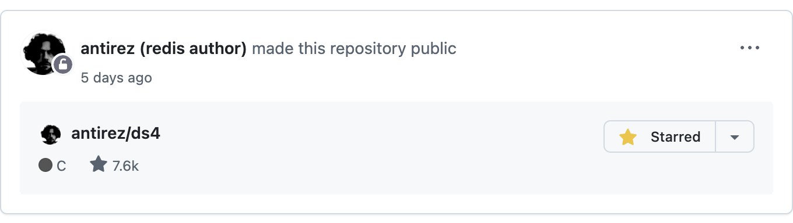

# User-Scripts

README [English](README.md) | [中文](README_ZH.md)

## 这是什么

这是 FantasticMao 的 Tampermonkey 用户脚本集合，用于增强和定制网页浏览体验。每个脚本都专注于解决特定的需求，让日常网页使用更加便捷。

|                                                                                       | 脚本名称        | 功能描述                               | 链接                                                                                                        |
| ------------------------------------------------------------------------------------- | --------------- | -------------------------------------- | ----------------------------------------------------------------------------------------------------------- |
|  | github-nickname | 在 GitHub 首页和个人主页为用户添加昵称 | [安装](https://raw.githubusercontent.com/fantasticmao/user-scripts/refs/heads/main/github-nickname.user.js) |

## 下载安装

### 安装 Tampermonkey

前置需要在浏览器中安装 Tampermonkey 扩展

- [Chrome 版本](https://chromewebstore.google.com/detail/dhdgffkkebhmkfjojejmpbldmpobfkfo)
- [Firefox 版本](https://addons.mozilla.org/en-US/firefox/addon/tampermonkey/)
- [Edge 版本](https://microsoftedge.microsoft.com/addons/detail/iikmkjmpaadaobahmlepeloendndfphd)

### 安装用户脚本

选择上方表格中对应脚本的安装链接，Tampermonkey 会自动弹出安装确认窗口，点击「安装」即可。

## 快速开始

### github-nickname 脚本

**效果预览**



**配置方式**

| 配置模式  | 说明                                               | 配置入口                             | 配置示例                             |
| --------- | -------------------------------------------------- | ------------------------------------ | ------------------------------------ |
| JSON 模式 | 输入 JSON 字符串，适合少量用户昵称                 | Tampermonkey 菜单 -> Config nickname | `{"torvalds": "Linux 之父"}`         |
| URL 模式  | 输入 JSON 远程文件地址，适合大量用户昵称或团队共享 | Tampermonkey 菜单 -> Config nickname | `https://example.com/nicknames.json` |

**配置步骤**

1. 点击浏览器工具栏中的 Tampermonkey 图标
2. 选择「Config nickname」菜单项
3. 在弹出的对话框中输入 JSON 字符串或 URL 地址
4. 点击确定保存配置

**JSON 格式**

```json
{
  "username": "昵称",
  "another-username": "另一个昵称"
}
```

**常见问题和回答**

Q: 如何更新昵称配置？

A: 重复上述配置步骤即可更新。JSON 模式会立即生效，URL 模式会在下次页面加载时获取最新配置。

Q: 支持哪些 GitHub 页面？

A: 目前支持 GitHub 首页（feed 页面）和用户个人主页（profile 页面）。

Q: 可以同时使用 JSON 模式和 URL 模式吗？

A: 不可以，两种模式只能选择其一，配置新的模式会自动清除旧的配置。

## 许可声明

User-Scripts [MIT License](LICENSE)

Copyright (c) 2026 fantasticmao
